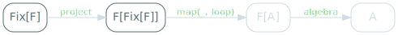

We've seen that making a data type "catamorphism-ready" was a lot of busywork:
- write the data type.
- write its pattern functor, which involves a lot of copy / pasting.
- write its projection into that pattern functor, which involves more copy / pasting.
- write a `Functor` instance, which involves yet more copy / pasting.

And you must do all of these things before you can start writing the interesting code, the thing that actually solves your problem, the F-Algebra.

The most frustrating bit is probably having to basically write the same type twice, given how close a type and its pattern functor are. The intuition that we'll follow here is that it might be possible to write one in terms of the other, since they're so similar.


## `List` in terms of `ListF`

We've seen that `ListF` can be used to represent something that's kind of a list. `ListF[List]` can be:
- `None`: the empty list.
- `Some((head, tail))`: a cons cell.

`ListF[List]` doesn't solve our problem though - we still have to define both `ListF` and `List`, which is exactly what we want to avoid.

Our goal is to write a type that's a `ListF` of _something_. Let's call that type `List2`, because it's kind of a list, but not a `List`:

```scala
type List2 = ListF[???]
```

And if you remember, that type parameter represents the tail of our list - think of `ListF[List]`. The tail of a list is a list: it's the smaller list to which we prepend `head` to get a complete one.

Logically, the tail of a `List2` must be of type `List2`:

```scala
type List2 = ListF[List2]
//        type List2 = ListF[List2]
//                           ^
// On line 2: error: illegal cyclic reference involving type List2
```

This unfortunately won't compile, because Scala doesn't allow recursive type aliases.

But this entire series of articles has been about recursive data types, so let's try that instead. If `List2` can't *be* a `ListF[List2]`, then it can *contain* one:

```scala
case class List2(value: ListF[List2])
```

## Building a `List2`

`List2` always makes me a bit confused, I have troubles seeing what it represents. When that happens, I like to draw things (badly) to help me visualise them, so let's try that here.


Here's how we'd declare our usual `3 :: 2 :: 1 :: nil` as a `List2`:

```scala
val ints2: List2 =
  List2(Some((3,
    List2(Some((2,
      List2(Some((1,
        List2(None)
      )))
    )))
  )))
```

And here's a potential visualisation of it, where `List2` itself is represented as a diamond:

<span class="figure">

</span>

You can still view our original list in there:

<span class="figure">

</span>

`List2` is really just structure that we needed to appease the compiler and have him accept a recursive type definition. The entire structure of a list is in `ListF`: an optional `head` and `tail`.

## Generalising `List2`

This was an interesting observation: `List2` itself doesn't encode the structure of a list, `ListF` does. If we were to use another pattern functor - `TreeF`, say, we would get an entirely different recursive data type:

```scala
case class Tree2(value: TreeF[Tree2])
```

And, yes, that is a tree: a `Tree2` contains a `TreeF`, which is one of:
- `LeafF`: the empty tree.
- `NodeF`: a tree node, containing a value and references to left and right `Tree2`s.

It doesn't get more tree-ish than that.

But `Tree2` and `List2` are basically the same thing, right? Different names, certainly, and we'll fix that soon, and a different pattern functor, but what's to stop us from turning that pattern functor into a parameter?

```scala
case class List2[F[_]](value: F[List2[F]])
```

Don't let the name fool you, that type is a generic data structure used to represent any recursive data type in terms of its pattern functor. It's not necessary obvious - that `F[List2[F]]` does my head in whenever I look at it - but put in concrete types:
- `List2[ListF]` is just recursive structure around a `ListF`: a list.
- `List2[TreeF]` is just recursive structure around a `TreeF`: a tree.

## Naming things

`List2` is clearly a bad name for something that is meant to represent any recursive data type. It turns out that this structure is well known and already has an official name: `Fix`, or the fixed-point combinator.

```scala
case class Fix[F[_]](value: F[Fix[F]])
```

The origin of that peculiar name is surprisingly straightforward, for once:
- the fixed-point of function `f` is `x` such that `f(x) = x`.
- `fix` is the function that, given a function, returns its fixed-point.
- if `fix(f)` is the fixed-point of `f`, then `fix(f) = f(fix(f))`
- that is exactly the definition we just wrote as Scala code.

## `List` in terms of `Fix`

Now that we know how to express a recursive data type in terms of its pattern functor, let's do so properly. Here's `FixedList`:

```scala
type FixedList = Fix[ListF]
```

You can create values of that type, although it's not very pleasant:

```scala
val fixedInts: FixedList =
  Fix[ListF](Some((3,
    Fix[ListF](Some((2,
      Fix[ListF](Some((1,
        Fix[ListF](None)
      )))
    )))
  )))
```

It could be worse though - we could be creating a tree.

## `Tree` in terms of `TreeF`

Speaking of the devil, here's `FixedTree`, a tree expressed as a `Fix` and a `TreeF`:

```scala
type FixedTree = Fix[TreeF]
```

And, yes, you can create values, if you hate yourself enough:

```scala
val fixedIntTree: FixedTree =
  Fix[TreeF](NodeF(
    Fix[TreeF](NodeF(
      Fix[TreeF](NodeF(Fix[TreeF](LeafF), 1, Fix[TreeF](LeafF))),
      2,
      Fix[TreeF](NodeF(Fix[TreeF](LeafF), 3, Fix[TreeF](LeafF)))
    )),
    4,
    Fix[TreeF](LeafF)
  ))
```

## `cata` with `Fix`

Now that we've done all that work, let's see some concrete benefits. Let's specialise our catamorphism implementation to recursive data types expressed in terms of `Fix`.

We'll start from `cata` and rename it:

```scala
def cataFix[F[_]: Functor, A, B](
  algebra: F[A] => A,
  project: B => F[B]
): B => A = {
  def loop(state: B): A =
    algebra(map(project(state), loop))
  loop
}
```

The first thing we'll do is change the input type, since we know it's not a `B` anymore:

<span class="figure">

</span>

`cataFix` works specifically for data types expressed as `Fix[F]`, which means that `B` becomes `Fix[F]` everywhere:

```scala
def cataFix[F[_]: Functor, A](
  algebra: F[A] => A,
  project: Fix[F] => F[Fix[F]]
): Fix[F] => A = {
  def loop(state: Fix[F]): A =
    algebra(map(project(state), loop))
  loop
}
```

On the other hand, while it does remove elements from the diagram, things get a little bit mystical there:


<span class="figure">

</span>

## Projecting `Fix`

The next step is to project our input type into its pattern functor:

<span class="figure">

</span>

There are two ways to go about that.

The first one is the usual, magical statically typed functional programming language gimmick: _given the types we have, there's only one way we could write it_. This would give us the correct answer almost immediately, at the cost of not having a clue why it's the correct answer other than _my imaginary friend the compiler told me_. We're not going to do that, because the point of this series of article is precisely for you to understand.

The second way is a bit more roundabout, but it works just as well: we'll start from the initial implementation of `project` for `List`, and refactor it. Let's start by renaming it `projectFix`:

```scala
val projectFix: List => ListF[List] = {
  case Cons(head, tail) => Some((head, tail))
  case Nil              => None
}
```

We know we want to write a version specific to `FixedList`, which is really just `Fix[ListF]`:

```scala
val projectFix: Fix[ListF] => ListF[Fix[ListF]] = {
  case Fix(Some((head, tail))) => Some((head, tail))
  case Fix(None)               => None
}
```

Note how we replaced `Cons` by `Fix(Some)` and `Nil` by `Fix(None)`.

If you take a look at the resulting pattern match, you'll see that in both cases, we're simply taking the value that's inside of the `Fix` and returning it.

We can rewrite the entire pattern match to just unwrap the value:

```scala
val projectFix: Fix[ListF] => ListF[Fix[ListF]] =
  _.value
```

And none of this code is specific to `ListF`, which allows us to turn it into a type parameter:

```scala
def projectFix[F[_]]: Fix[F] => F[Fix[F]] =
  _.value
```

`projectFix` is simply unwrapping a layer of `Fix`.

This allows us to rewrite `cataFix` to not need a projection function anymore, since it'll always just be accessing the `value` field:

```scala
def cataFix[F[_]: Functor, A](
  algebra: F[A] => A
): Fix[F] => A = {
  def loop(state: Fix[F]): A =
    algebra(map(state.value, loop))
  loop
}
```

Which gives us the following diagram:

<span class="figure">

</span>

## Functor instance

At this point, everything becomes a lot easier. We need to be able to run `map` on our pattern functor.

<span class="figure">

</span>

There's no additional work required here though: our pattern functor, by definition, already has a `Functor` instance. We already defined the functor instances of `ListF` and `TreeF`, we don't have to do it again.

## F-Algebra

Similarly, we don't need to redefine F-Algebras: they work on the pattern functor directly, which is what we have at this stage.

<span class="figure">

</span>

We can reuse all the F-Algebras that we have defined earlier without any additional change.

## `product` in terms of `cataFix`

`productFix`, the version of `product` that works on `FixedList`, is simpler to define than it used to be, since we can ignore the projection:

```scala
val productFix: FixedList => Int =
  cataFix(productAlgebra)
```

And it still yields the expected result:

```scala
productFix(fixedInts)
// res21: Int = 6
```

## `height` in terms of `cataFix`

Same goes for `heightFix`, the version of `height` that works on a `FixedTree`:

```scala
val heightFix: FixedTree => Int =
  cataFix(heightAlgebra)
```

Applying it to our standard tree yields the same result as before:

```scala
heightFix(fixedIntTree)
// res22: Int = 3
```

## Cost of `Fix`

Everything seems to work out nicely, but there's a cost.

Pattern matching is a very common activity, and it suddenly got less pleasant. Here's how we do it now:

```scala
def headOpt(list: FixedList): Option[Int] = list match {
  case Fix(Some((head, _))) => Some(head)
  case Fix(None)            => None
}
```

Compare it to how we did it before `Fix`:

```scala
def headOpt(list:      List): Option[Int] = list match {
  case Cons(     head, _)   => Some(head)
  case Nil                  => None
}
```

It's not a drastic change, but there's certainly more boilerplate, and a requirement that you know and understand a more complex structure.

People might argue that this is unfair, that the entire point of catamorphisms is that you shouldn't have to do pattern matching anymore. I think that's only partly true, pattern matching is still a useful tool to have, but let's pretend that the argument is correct.

What about creating values? Surely that's something that we expect people to do quite a bit of - after all, the reason we write data types is to be able to manipulate values of these types, and these values need to be created at some point.

Here's what you have to do now:

```scala
val list: FixedList =
  Fix[ListF](Some((3,
    Fix[ListF](Some((2,
      Fix[ListF](Some((1,
        Fix[ListF](None)
      )))
    )))
  )))
```

Here's how we did it before introducing `Fix`:

```scala
val list:      List =
  Cons(            3,
    Cons(            2,
      Cons(            1,
        Nil
      )
    )
  )
```

That is unarguably worse - and we already thought that the original way of creating values was too noisy!

## Key takeaways

We've seen that we could use `Fix` to simplify a few things - for data type authors. As a data type author, I do not have to write my type *and* its pattern functor, nor the projection of the former into the later. Using `Fix` made my life better.

Once, though. I would only ever have to write the pattern functor and the projection once in the entire lifetime of my data type.

On the other hand, using `Fix` makes your life, as the data type consumer, less pleasant: pattern matching and value creation have become more complex. It's made your life worse *every time you want to create a value*.

I feel this is exactly the wrong trade off to make. I should be dealing with the complexity so you don't have to, not pushing it onto you so that I can ignore it.

Here's my (admittedly snarky) take on `Fix`. Using it makes:
- the hard things easier (for me, the data type author).
- the easy things harder (for you, the data type consumer).
- little sense.

It's unfortunate that virtually every blog post or article explaining recursion schemes will do so through `Fix`, because on top of not being a requirement, it's not even a good idea!
