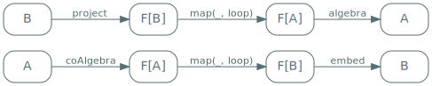
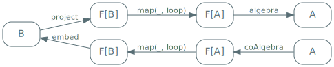
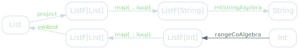
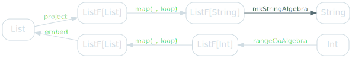
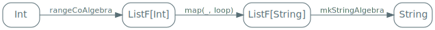

We've seen that generalised folds (`cata`) and generalised unfolds (`ana`) seemed eerily similar.

In this last part of the series, we'll explore that similarity.

## `cata` and `ana`

If you look at `cata` and `ana` as diagrams, it's kind of hard to tell which is which:

<span class="figure">

</span>

We know that `cata` uses algebras and `ana` co-algebras, so the top part of the diagram is `cata` and the bottom one `ana`. But they do look very similar.

They are, in fact, similar in two distinct ways.

## Duality of `cata` and `ana`

The first way is more visible if you sort of flip the diagram for `ana` around - not changing its meaning, just the layout of the nodes:

<span class="figure">

</span>

And if you look at it in that light, you can see that `ana` is just `cata`, but with the arrows "flipped": the same nodes, but arrows going in opposite directions.

This is what people mean when they say that `cata` and `ana` are duals of each other: they're the opposite of one another. Intuitively, it makes sense: you use `cata` to fold a recursive data type into a single value, while `ana` unfolds a single value into a recursive data type.

This is the first way in `cata` and `ana` are similar - they're opposite of each other.

## Composing `cata` and `ana`

But if `cata` and `ana` are duals of each other, it means that one starts where the other ends, doesn't it? It means we can compose them, such as by applying a `cata` to the result of an `ana`:

<span class="figure">

</span>

For example, we can compose `range` and `product`.

`range` yields numbers from 1 to a given number, and `product` multiplies them together: that's `factorial` - an extremely inefficient implementation of it, but `factorial` nonetheless:

```scala
val factorial: Int => Int =
  range andThen product

factorial(3)
// res40: Int = 6
```


Similarly, the composition of `range` an `mkString` is the string representation of a range:

```scala
val showRange: Int => String =
  range andThen mkString

showRange(3)
// res41: String = 3 :: 2 :: 1 :: nil
```

## Simplifying `ana andThen cata`

Let's look at `showRange` in more details. Here's the corresponding diagram, with all concrete types and functions filled in:

<span class="figure">

</span>

If you look at the leftmost part of this diagram, you can see that there seems to be some unnecessary segments: we go from a `ListF[List]` to a `List` and back to a `ListF[List]`.

Let's see if this intuition is valid by looking at actual values. We're going to detail the steps of `showRange(3)`. According to our diagram, we'll start with `rangeCoAlgebra`:

<span class="figure">

</span>

Here's the code for that function:

```scala
val rangeCoAlgebra: Int => ListF[Int] = i => {
  if(i > 0) Some((i, i - 1))
  else      None
}
```

If you run through it, you eventually end up with nested `Some`s that represent the `3 :: 2 :: 1` list:


```scala
Some((3, Some((2, Some((1, None))))) // rangeCoAlgebra
```

According to our diagram, after doing some recursion magic via `map`, we need to apply `embed`:

<span class="figure">

</span>

Here's the code for `embed`, which tells us to map `Some` to `Cons`, `None` to `Nil` and leave the `head` alone:

```scala
val embed: ListF[List] => List = {
  case Some((head, tail)) => Cons(head, tail)
  case None               => Nil
}
```

Applying that to our previous nested `Some`s yields:

```scala
Some((3, Some((2, Some((1, None))))) // rangeCoAlgebra
Cons( 3, Cons( 2, Cons( 1, Nil )))   // embed
```

Our next step is going to be `project`:

<span class="figure">

</span>

This essentially undoes what `embed` did: it maps `Cons` to `Some`, `Nil` to `None` and leaves the `head` alone:


```scala
val project: List => ListF[List] = {
  case Cons(head, tail) => Some((head, tail))
  case Nil              => None
}
```

Unsurprisingly, this yields the value we had before applying `embed`.

```scala
Some((3, Some((2, Some((1, None))))) // rangeCoAlgebra
Cons( 3, Cons( 2, Cons( 1, Nil )))   // embed
Some((3, Some((2, Some((1, None))))) // project
```

Finally, after running through some more recursive `map` magic, we need to apply `mkStringAlgebra`:

<span class="figure">

</span>

This tells us to map `Some` to `step`, `None` to `base` and leave the `head` alone:

```scala
val mkStringAlgebra: ListF[String] => String = {
  case Some((head, tailResult)) => step(head, tailResult)
  case None                     => base
}
```

This is our final state before actually getting `showRange`'s result:

```scala
Some((3, Some((2, Some((1, None))))) // rangeCoAlgebra
Cons( 3, Cons( 2, Cons( 1, Nil )))   // embed
Some((3, Some((2, Some((1, None))))) // project
step( 3, step( 2, step( 1, base)))   // mkStringAlgebra
```

And it really does seem that steps 2 (`embed`) and 3 (`project`) could be skipped - they're just a round trip back to the result of `rangeCoAlgebra`.

These are the steps we'd like to have instead:

```scala
Some((3, Some((2, Some((1, None))))) // rangeCoAlgebra
step( 3, step( 2, step( 1, base)))   // mkStringAlgebra
```

Which would be the following diagram:

<span class="figure">

</span>

Let's make that diagram generic - replacing hard-coded things with parameters:

<span class="figure">

</span>

You'd be forgiven for assuming I made a mistake and copied the diagram for `ana` here, but they are slightly different:

<span class="figure">

</span>

Do you see the difference? It's just in the name of the last arrow. Our desired function has `algebra` where `ana` has `embed`.

It's just a parameter name though, we can refactor `ana` to take `algebra` without changing its behaviour:

```scala
def ana[F[_]: Functor, A, B](
  coAlgebra: A => F[A],
  algebra  : F[B] => B
): A => B = {

  def loop(state: A): B =
    algebra(map(coAlgebra(state), loop))

  loop
}
```

And this actually works out: if you write `showRange` as an anamorphism, you get the expected output:

```scala
def showRange: Int => String =
  ana(rangeCoAlgebra, mkStringAlgebra)

showRange(3)
// res42: String = 3 :: 2 :: 1 :: nil
```

## Naming things

Even though this is just `ana` with an essentially meaningless difference, this has a fancy name: hylomorphism, or `hylo` for short:

```scala
def hylo[F[_]: Functor, A, B](
  coAlgebra: A => F[A],
  algebra  : F[B] => B
): A => B = {

  def loop(state: A): B =
    algebra(map(coAlgebra(state), loop))

  loop
}
```

It does seem weird to consider that `hylo` and `ana` are different things when their code is the same though, isn't it?

Well...

## A magic trick

For my next trick, we're going to perform some purely cosmetic refactoring of `hylo`.

First, swap the `A`s and the `B`s - this doesn't actually change anything, they're just arbitrary names.

```scala
def hylo[F[_]: Functor, A, B](
  coAlgebra: B => F[B],
  algebra  : F[A] => A
): B => A = {

  def loop(state: B): A =
    algebra(map(coAlgebra(state), loop))

  loop
}
```

We'll then change the declaration order of `algebra` and `coAlgebra`:

```scala
def hylo[F[_]: Functor, A, B](
  algebra  : F[A] => A,
  coAlgebra: B => F[B]
): B => A = {

  def loop(state: B): A =
    algebra(map(coAlgebra(state), loop))

  loop
}
```

Finally, we'll rename `coAlgebra` to `project`.

```scala
def hylo[F[_]: Functor, A, B](
  algebra: F[A] => A,
  project: B => F[B]
): B => A = {

  def loop(state: B): A =
    algebra(map(project(state), loop))

  loop
}
```

And now that we've done that, I'd like you to tell me the differences between `hylo` and `cata`. [Here's](./cata#naming-things) the implementation of `cata` we'd arrived at, if you need to refresh your memory.

Surprising, isn't it? `hylo` and `cata` are *also* the same thing.

This is the second way in which `cata` and `ana` are similar: they're *the same thing*.

## Key takeaways

We've seen that `cata` an `ana` were similar in two distinct way:
* they are duals of each other - they're doing opposite things.
* they are also the same thing.

Yes, this is a bit headache inducing. But there's a reasonable explanation! The issue, here, is that our types are not precise enough.

We've defined `cata` as structural recursion for types that can be projected into a pattern functor. And it's true that a projection is a kind of co-algebra - they both have the same type, after all: `A => F[A]`. But not all co-algebras are projections: `rangeCoAlgebra`, for example, doesn't project a recursive data type into its pattern functor.

Similarly, embeddings are algebras, but not all algebras are embeddings.

This is the crucial distinction between `ana`, `cata` and `hylo`:
* `cata` is a specialised kind of `hylo` used to collapse a recursive data type onto itself.
* `ana` is a specialised kind of `hylo` used to blow a value into a recursive data type.
* `hylo` is both of these things, generalised arguably further than is strictly sane.
