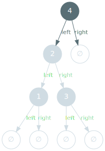
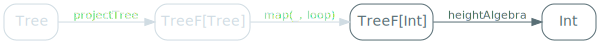

We've seen that structural recursion could be generalised to catamorphisms, and that these are, in theory, capable of working with any type that can be projected into a pattern functor.

So far however, we've only seen `List`. We're going to take a look at another recursive data type, with two goals in mind:
- give you some measure of confidence that catamorphisms work on more than just `List`.
- demonstrate how to take an existing type and make it "catamorphism-ready".

## Binary tree

Having done the simplest recursive data type I could think of, the monomorphic list, we're going to look at the second simplest: the monomorphic binary tree.

<span class="figure">

</span>

The simplest possible tree is the empty one, which we call a `leaf`:

<span class="figure">

</span>


A non empty tree is called a `node`, and composed of:
- the `value` its contains.
- a `left` branch, referencing the node's left subtree.
- a `right` branch, referencing the node's right subtree.

<span class="figure">

</span>

We can encode this almost directly to Scala code:

```scala
sealed trait Tree

case class Node(
  left : Tree,
  value: Int,
  right: Tree
) extends Tree

case object Leaf extends Tree
```

Like `List`, however, creating values is a bit cumbersome - a recurring problem with recursive data types:

```scala
val intTree =
  Node(
    Node(
      Node(Leaf, 1, Leaf),
      2,
      Node(Leaf, 3, Leaf)
    ),
    4,
    Leaf
  )
```

## Tree height

The problem we're going to solve is the height of a tree, which is defined as:

> The height of a tree is the length of the longest path between its root and a non-leaf node.

Graphically, we see that our sample tree has a height of 3:

<span class="figure">

</span>

Our goal is to compute this using a catamorphism. In order to do that, we'll do the exact opposite of what we did before: go from the generic definition of a catamorphism, and make everything concrete.

Our first step is to nail down the input type:

<span class="figure">

</span>

This is straightforward: we know that the input type of a function that computes a tree's height must be of type `Tree`.

<span class="figure">

</span>

## Pattern functor

Once we have the input type, we need its pattern functor:

<span class="figure">

</span>

We could use the same trick we did, almost by mistake, for `List`, and use an optional left branch, right branch and value, but I would rather avoid that. Tuples quickly confuse me, parenthesis everywhere, confusing field names...

Instead, we'll use a very mechanical approach, one that you can apply to any recursive data type you encounter.

The first step is to take your type and its branches, and append `F` to their names:

```scala
sealed trait TreeF

case class NodeF(
  left : Tree,
  value: Int,
  right: Tree
) extends TreeF

case object LeafF extends TreeF
```

The second step is to add a type parameter. Remember that the pattern functor's type parameter is used to represent the recursive part of your data type, which is how we can map it to the type of the problem before and after it's been solved. This means that we must replace any occurrence of `Tree` in `TreeF` and its subtypes with our type parameter:

```scala
sealed trait TreeF[+A]

case class NodeF[A](
  left : A,
  value: Int,
  right: A
) extends TreeF[A]

case object LeafF extends TreeF[Nothing]
```

Don't worry if you don't understand the `+A` and `Nothing` bits - it's perfectly safe to consider them as a syntactic trick to be able to declare `LeafF` as an object.

And that's our pattern functor! In the case of the height of a tree, for example, we know that we'll be manipulating two `TreeF` types:
- `TreeF[Tree]`, representing the explicit split of larger problems into smaller ones.
- `TreeF[A]`, representing larger problems and the solution to the smaller ones that compose them.


<span class="figure">

</span>

## Projection

Having our input type, `Tree`, and its pattern functor, `TreeF`, we need to be able to project the former into the later:

<span class="figure">

</span>

This is a straightforward mapping of `Node` to `NodeF` and `Leaf` to `LeafF`:

```scala
def projectTree: Tree => TreeF[Tree] = {
  case Node(l, v, r) => NodeF(l, v, r)
  case Leaf          => LeafF
}
```

Which gives us the following updated diagram:

<span class="figure">

</span>

## Functor instance

Of course, `TreeF`, being a pattern functor, needs to have a functor instance - otherwise we can't call `map`.

<span class="figure">

</span>

We can provide this instance by applying the exact same logic we used for `ListF`: apply the mapped-over function to each recursive parts of a tree.

```scala
implicit val treeFFunctor = new Functor[TreeF] {
  override def map[A, B](tree: TreeF[A], f: A => B) =
    tree match {
      case NodeF(left, i, right) => NodeF(f(left), i, f(right))
      case LeafF                 => LeafF
    }
}
```

This is such a mechanical implementation that it's most likely possible to derive it automatically (I've successfully done it for `TreeF` using [kittens](https://github.com/typelevel/kittens) but cannot guarantee that it's always possible - just that I haven't encountered a case where it wasn't).


## F-Algebra

Finally, we get to the one piece that's of any actual interest: the F-Algebra. The part where we actually compute the height of our tree.

<span class="figure">

</span>

The base case is obvious: the height of an empty tree is 0.

The step case is also relatively intuitive: we're given the height of the left and right subtrees. The largest of these values is the longest path from a direct descendant of the current node to a non-leaf node, and adding one to this yields the height of the tree.


```scala
val heightAlgebra: TreeF[Int] => Int = {
  case NodeF(left, _, right) => 1 + math.max(left, right)
  case LeafF                 => 0
}
```

This gives us the last missing piece of our problem:

<span class="figure">

</span>


## Tree height

We can now declare the `height` combinator by putting all these things together in a catamorphism:

```scala
val height: Tree => Int =
  cata(heightAlgebra, projectTree)
```

And this, fortunately, yields the expected result:

```scala
height(intTree)
// res20: Int = 3
```

## Key takeaways

It does seem that catamorphisms work for more types than just the monomorphic list. But... it certainly involves a lot of busywork, doesn't it?

Next, we'll be looking at an unfortunately popular technique for addressing this issue.
