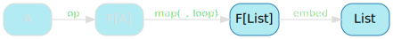

We have implemented a generalised generative recursion function for lists, `unfold`. Our task it to now turn it into a proper recursion scheme: generative recursion that works for *any* recursive data type.

## Generalised unfolds

We'll take the same approach as before: go from the `List`-specific `unfold`, and refactor it until it's not `List`-specific anymore.

Here's our `unfold` implementation:

```scala
def unfold[A](
  predicate: A => Boolean,
  update   : A => (Int, A)
): A => List = {

  def loop(state: A): List =
    if(predicate(state)) {
      val (head, nextState) = update(state)
      Cons(head, loop(nextState))
    }
    else Nil

  loop
}
```

We'll be using a shortcut, though: now that we know about pattern functors and their ability to represent intermediate steps in a recursive algorithm, we'll try and use them as soon as possible.

## Simplifying `predicate` and `update`

The first place where we can see the shape of `ListF`, the pattern functor for list, is in `predicate` and `update`:

<span class="figure">

</span>

If you squint, they're really a single function from state to optional head and next state:

<span class="figure">

</span>

Let's call this single function `op` because I'm not above a little foreshadowing.

`op` evaluates our predicate (_is the string empty?_) and, if true, wraps the result of `update` in `Some`. If `false`, it'll return a `None`.

```scala
val op: String => ListF[String] =
  state => {
    if(state.nonEmpty) Some((state.head.toInt, state.tail))
    else               None
  }
```

This allows us to simplify `loop` into a pattern match:

```scala
def unfold[A](
  op: A => ListF[A]
): A => List = {

  def loop(state: A): List =
    op(state) match {
      case Some((head, nextState)) => Cons(head, loop(nextState))
      case None                    => Nil
    }

  loop
}
```

`unfold` now looks like this suddenly much more familiar diagram:

<span class="figure">

</span>

## Abstracting over structure

While we're trying to force `ListF` into `unfold`, let's take a look at the other side of the diagram:

<span class="figure">

</span>

That's really a function that, given an optional head and tail (a `ListF`), turns it into a list.

That function is commonly known as `embed` and has a straightforward implementation:

```scala
val embed: ListF[List] => List = {
  case Some((head, tail)) => Cons(head, tail)
  case None               => Nil
}
```

If we have a head and tail, we'll turn them into a list. Otherwise, we have the empty list.

We can update `unfold` to take `embed` as a parameter, which allows us to get rid of explicit references to `Cons` and `Nil`:

```scala
def unfold[A](
  op   : A => ListF[A],
  embed: ListF[List] => List
): A => List = {

  def loop(state: A): List =
    op(state) match {
      case Some((head, state)) => embed(Some((head, loop(state))))
      case None                => embed(None)
    }

  loop
}
```

As before with `cata`, note that `embed` is called on the result of both branches of the pattern match, which allows us to move it outside:

```scala
def unfold[A](
  op   : A => ListF[A],
  embed: ListF[List] => List
): A => List = {

  def loop(state: A): List =
    embed(op(state) match {
      case Some((head, state)) => Some((head, loop(state)))
      case None                => None
    })

  loop
}
```

This results in a slightly more complex but, again, suspiciously familiar diagram:

<span class="figure">

</span>

## Using Functor

Now that we've shoehorned a pattern functor in `unfold`, everything sort of falls together. Take a look at the central part of our diagram.

<span class="figure">

</span>

We're turning a `ListF[A]` into a `ListF[List]` by applying an `A => List` function to the `A`. This is functors all over again!

We can take out that entire pattern match and replace it with `map`, because they're exactly the same thing:

```scala
def unfold[A](
  op   : A => ListF[A],
  embed: ListF[List] => List
): A => List = {

  def loop(state: A): List =
    embed(map(op(state), loop))

  loop
}
```

This simplifies our diagram quite nicely:

<span class="figure">

</span>

## Abstracting over `ListF`

We still have a few lose ends to tie up though. First, `ListF`:

<span class="figure">

</span>

This is very `List` specific, and we want it out. Luckily for us, the only thing we actually need to know about `ListF` is that we can call `map` on it - that it has a functor instance. We can replace it with a type parameter with the same constraints:

```scala
def unfold[F[_]: Functor, A](
  op   : A => F[A],
  embed: F[List] => List
): A => List = {

  def loop(state: A): List =
    embed(map(op(state), loop))

  loop
}
```

And this gets rid of `ListF` completely.

<span class="figure">

</span>

## Abstracting over `List`

Finally, our `unfold` is still hard-coded to `List` as its output type.

<span class="figure">

</span>

It really doesn't need to be though, since we never use the fact that we're working with a list - just a type that `op` and `embed` know how to work with.

This allows us to turn it into a type parameter:

```scala
def unfold[F[_]: Functor, A, B](
  op   : A => F[A],
  embed: F[B] => B
): A => B = {

  def loop(state: A): B =
    embed(map(op(state), loop))

  loop
}
```

And, finally, we don't have anything `List`-specific left in our `unfold`.

<span class="figure">

</span>

## Naming things

Now that we have a completely generalised `unfold`, it's time to give it a proper name. This is known as an _anamorphism_, _ana_ for short:

```scala
def ana[F[_]: Functor, A, B](
  op   : A => F[A],
  embed: F[B] => B
): A => B = {

  def loop(state: A): B =
    embed(map(op(state), loop))

  loop
}
```

That names follows exactly the same logic as _catamorphism_: its entire point is to make sure you know that whoever uses it is smarter than you are.

And, of course, `op` is not the right name for that `A => F[A]`.

If you remember, with `cata`, we had an `F[A] => A`, which we called an algebra. It has a very similar type to `op` - it is, in fact, the same thing with the "arrow flipped". Flipping arrows is a very popular activity among people who understand category theory, and whenever they manage it they say the thing with the flipped arrow is the dual of the original thing, and is a _co-_ original thing.

It should come as no surprise, then, that `op` is really known as a co-algebra.

```scala
def ana[F[_]: Functor, A, B](
  coAlgebra: A => F[A],
  embed    : F[B] => B
): A => B = {

  def loop(state: A): B =
    embed(map(coAlgebra(state), loop))

  loop
}
```

`ana` works exactly as before for `charCodes`:

```scala
mkString(ana(op, embed).apply("cata"))
```

And now that we've named everything properly, we get the complete diagram for `ana`:

<span class="figure">

</span>

## `range` as an ana

We know that `charCodes` can be implemented as a specific version of `ana` - this is what we've been doing all along.

Here's how you'd do `range` as an anamorphism:

```scala
val rangeCoAlgebra: Int => ListF[Int] = i => {
  if(i > 0) Some((i, i - 1))
  else      None
}

val range: Int => List =
  ana(rangeCoAlgebra, embed)
```

And you'd get the exact same result as with the initial implementation:

```scala
mkString(range(3))
// res39: String = 3 :: 2 :: 1 :: nil
```

## Key takeaways

We've seen that anamorphisms were generalised unfolds for types that could be embedded from a pattern functor, and that inventing them was mostly a matter of forcing a pattern functor in a non-general `unfold`.

Something that's a bit surprising is how similar to catamorphisms they end up looking, though. There's clearly some interesting thread to pull there.
