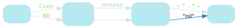
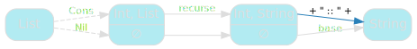
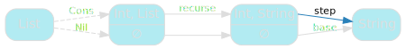
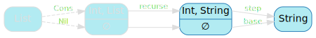
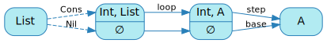

We've seen that structural recursion involved a few common components. Our goal, for the moment, is to abstract these components away and provide a general structural recursion function.

## Generalising `mkString`

We'll start from `mkString`, and refactor it step-by-step until we reach the desired result:

```scala
def mkString(
  values: List
): String =
  values match {
    case Cons(head, tail) => head + " :: " + mkString(tail)
    case Nil              => "nil"
  }
```

Our first step is going to be to rename `mkString`. Let's call it `recurse` - it's a pretty bad name, but now is the worst possible time to try and find a good one: we do not yet know what we'll end up with and how it will be used. I find it useful to not worry overmuch about names until after I have a much better understanding of what it is I'm trying to name.

```scala
def recurse(
  values: List
): String =
  values match {
    case Cons(head, tail) => head + " :: " + recurse(tail)
    case Nil              => "nil"
  }
```

`recurse` can be represented using the following diagram:

<span class="figure">

</span>

We start from a `List`, follow its structure to turn into into a head and a tail (`Cons`) or nothing (`Nil`), apply `recurse` to the tail, then some hard-coded magic to get our final result.

The hard-coded magic is what we want to get rid of.


## Generalising the base case

The easiest thing to tackle is providing a solution to the smallest possible problem - known as the base case. This is currently hard-coded to `"nil"`:

<span class="figure">

</span>

Instead of using a hard-coded string, let's extract this into a constant:

```scala
​val base = "nil"
```

And we can now rework `recurse` to take `base` as a parameter:

```scala
def recurse(
  base  : String,
  values: List
): String =
  values match {
    case Cons(head, tail) => head + " :: " + recurse(base, tail)
    case Nil              => base
  }
```

This is an improvement; at least some of the hard-coded magic is gone now:

<span class="figure">

</span>

## Generalising the step

We still have a little bit left, though:

<span class="figure">

</span>

This takes the `head`, the solution to the `tail`, and returns the complete solution to our problem. It can be represented as a simple function, traditionally known as `step`:

```scala
def step(head: Int, tailResult: String) =
  head + " :: " + tailResult
```

As before, now that we have a `step` implementation for `mkString`, we can remove the hard-coded one from `recurse` and take it as a parameter:

```scala
def recurse(
  base  : String,
  step  : (Int, String) => String,
  values: List
): String =
  values match {
    case Cons(head, tail) => step(head, recurse(base, step, tail))
    case Nil              => base
  }
```

And with that, we appear to have gotten rid of all the hard-coded values:

<span class="figure">

</span>

## Generalising the return type

There is, however, still a little bit of hard-coding going on, just not at the value level: the return type of `recurse`.

<span class="figure">

</span>

It's currently `String`, but we know we'll need more than that: `product` returns an `Int`, for example.

This is fortunately straightforward to generalise: we never actually use the fact that this return type is `String` - just that `base` and `step` take matching types. This allows us to turn it into a type parameter:

```scala
def recurse[A](
  base  : A,
  step  : (Int, A) => A,
  values: List
): A =
  values match {
    case Cons(head, tail) => step(head, recurse(base, step, tail))
    case Nil              => base
  }
```

And now, we've gotten rid of everything that was specific to `mkString`:

<span class="figure">

</span>


## Simplifying the step

We can touch up the code a little bit before going further though. Short as it is, I find `recurse` slightly unpleasant to read.

Specifically, I don't like the recursive call to `recurse` and the fact that it takes so many parameters. It makes it harder than necessary to understand what's going on, where I really wish it could just say _get the solution to the `tail`_, without added noise.

One thing I like to do in these circumstances is create internal helper functions. Here, we can take the entire pattern match and extract it into a helper that's traditionally called `loop` or `go`:

```scala
def recurse[A](
  base  : A,
  step  : (Int, A) => A,
  values: List
): A = {
  def loop(state: List): A =
    state match {
      case Cons(head, tail) => step(head, loop(tail))
      case Nil              => base
    }

  loop(values)
}
```

This is admittedly more code than we had, but the structural recursion components are now more clearly visible in `loop`. We can see:
- the smallest possible problem (`Nil`), with a solution of `base`.
- larger problems (`Cons`), composed of a smaller problem (`tail`) and additional data (`head`).
  - the solution to the smaller problem is assumed known (by calling `loop`).
  - the solution to the larger problem is obtained by gluing everything together with `step`.

This gives us an updated diagram for `recurse`:

<span class="figure">

</span>

## Dropping parameters

Finally, we can see that the `values` parameter of `recurse` is just passed to `loop` - the former is really just a proxy for the later.

Let's make that more concrete by having `recurse` return `loop` instead:

```scala
def recurse[A](
  base: A,
  step: (Int, A) => A
): List => A = {
  def loop(state: List): A =
    state match {
      case Cons(head, tail) => step(head, loop(tail))
      case Nil              => base
    }

  loop
}
```

One might argue that this isn't much of an improvement - the only real change for callers is that `recurse` now has two parameter lists, which, while not horrible, is certainly less straightforward than a single one.

But it *is* an improvement when you consider the most common use case: declaring combinators that rely on `recurse`. Take the by now familiar `mkString`:

```scala
def mkString(ints: List): String =
  recurse(base, step)(ints)
```

We can conveniently refactor it to:

```scala
val mkString: List => String =
  recurse(base, step)
```

Which I'd argue is more explicit: `mkString` is just a specific application of `recurse`.


## Naming things

Now that we're all but done with `recurse` and we have a better understanding of what it does, it's time to give it a proper, functional programming name.

You might have already encountered it, it's a very common combinator: `fold`.

The name is a little bit poetic: it describes the way you fold the list onto itself to get your result.

```scala
def fold[A](
  base: A,
  step: (Int, A) => A
): List => A = {
  def loop(state: List): A =
    state match {
      case Cons(head, tail) => step(head, loop(tail))
      case Nil              => base
    }

  loop
}
```

## product as a fold

We've done all this work of generalising `mkString` to be able to use it to write other combinators, it'd be a shame not to end this section by showing that `product` can easily be written as a specific `fold`:

```scala
val product: List => Int =
  fold[Int](
    base = 1,
    step = (head, tailProduct) => head * tailProduct
  )
```

## Key takeaways

We've seen that generalising structural recursion was a relatively straightforward task: simply make all key components parameters, and everything just sort of works out.

Well. Provided you don't mind hard-coding your implementation to the structure of a specific type, that is. Our `fold` works for lists, but that's it. We should try to do something about that.
